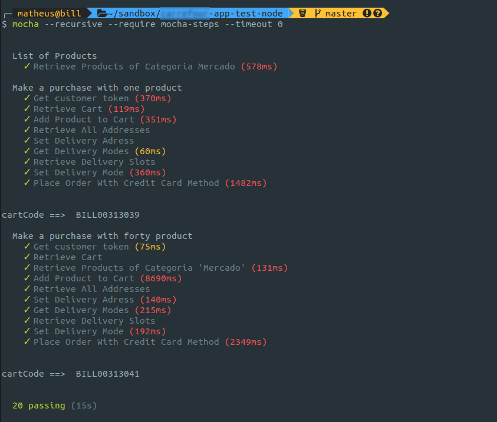

# carrefour-app-test-node

Teste automatizado da API do Carrefour para o APP.

Pré-requisito: NodeJS >= 11.0.0
 
*(Minha recomendação pessoal de leitura para instalação do Node.JS: https://medium.com/collabcode/como-instalar-node-js-no-linux-corretamente-ubuntu-debian-elementary-os-729fb4c92f2d)*

## Instruções de instalação

### Instale as dependências de teste globalmente
```bash
npm install -g mocha mocha-steps
```

### Instale as dependências de teste no projeto
```bash
npm i
```

### Na pasta do projeto execute
```bash
mocha --recursive --require mocha-steps --timeout 0 
```

### O resultado no terminal será o seguinte

